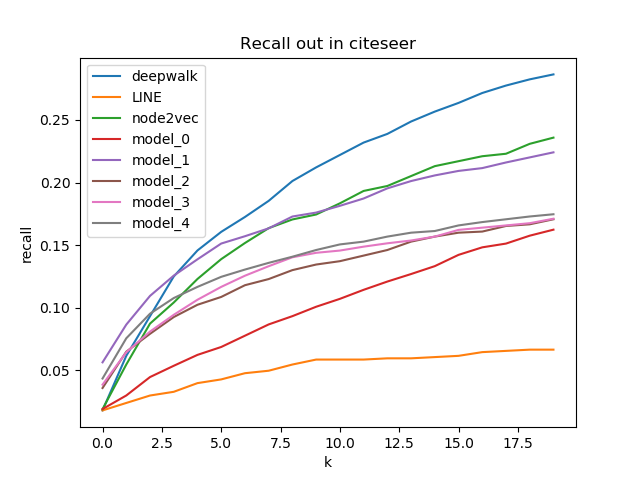
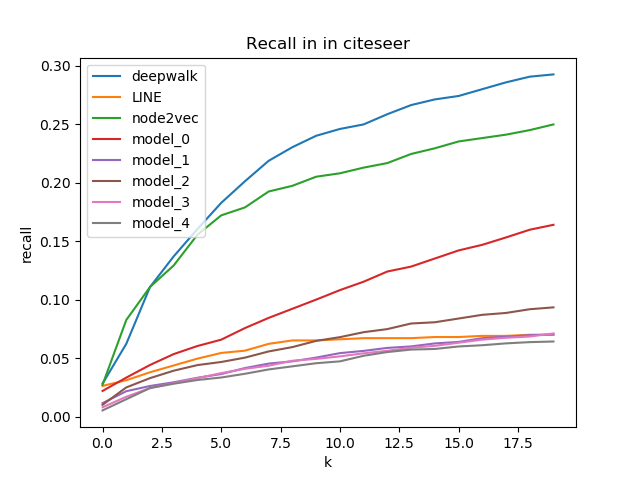
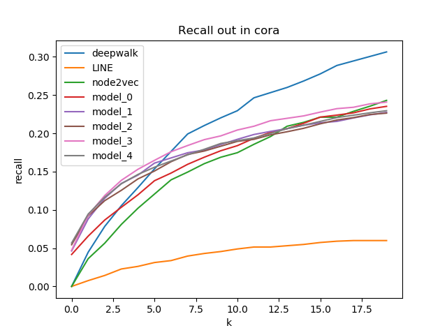
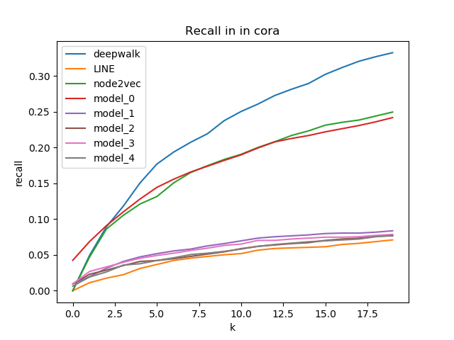

Updated 2020/3/8 23:30

## Re-implement random walk models. 

To make the dataset split and evaluation method consistent with other gcn-based models.

## Re-implement GCN models

The reimplemented code is copied from the repo `Intellifusion-graph` which is a tensorflow version (dgl and pyg cannot obtain normal output).

**Some changes**. The epoch in different models is adjusted to the same value (original code is different).
The dataset split was also adjusted to the same. Other aspects as lr, dropout etc are not modified that is same with the original  `Intellifusion-graph` code.

Notes: The epoch in GAE is 200, but in model_1/2/3/4 is 2000. When increasing training epoch in GAE, its performance drop large
Also, decresing the epoch in model_1/2/3/4 their performance are also unsatisfied. (This is the configure in  `Intellifusion-graph` )

Besides, the learning rate in GAE is 0.01 while in other four models is 0.0005 (This is the configure in  `Intellifusion-graph` )

Random walk methods are same with previous implementation and difference is in the evaluation method

The variance of the result is a little big, the following results just as reference

model_0: GAE (tensorflow)

